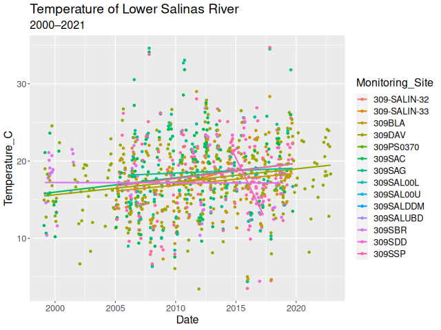

# Version Control Using Git

## Why Use Version Control Software

Imagine not using version control software. How do you safeguard against
inadvertantly adding bugs to your code? You make a copy, maybe with the date
appended to the name, and blaze ahead. 

Can be hosted online
Good for code review

ReLEPTON (ReLEP subaTOmic kNock-off)

```
data_import <- read.csv("./data.csv") 
data <- within(data_import, date <- as.Date(date))
criteria <- 21 # C°

# Make LOEs table
loes_total <- as.data.frame(table(data$Monitoring_Site))
names(loes_total) <-  c("Monitoring_Site", "Total")
loes_exceedances <- aggregate(Temperature_C ~ Monitoring_Site, 
                              data = data, 
                              FUN = \(x) sum(x >= criteria))
names(loes_exceedances) <- c("Monitoring_Site", "Exceedances")
loes <- merge(loes_exceedances, loes_total)
# write.csv(loes, "loes.csv")
```

```
loes
#>    Monitoring_Site Exceedances Total
#> 1     309-SALIN-32           0     5
#> 2     309-SALIN-33           0     5
#> 3           309BLA          27   173
#> 4           309DAV          61   277
#> 5        309PS0370           0     1
#> 6           309SAC          56   180
#> 7           309SAG          38   117
#> 8        309SAL00L           0     1
#> 9        309SAL00U           0     1
#> 10       309SALDDM           1     1
#> 11       309SALUBD           1     1
#> 12          309SBR           9    56
#> 13          309SDD           9    38
#> 14          309SSP          48   164
```

```{.r #hl}
library(tidyverse)

data_import <- read.csv("./data.csv") 
data <- within(data_import, Date <- as.Date(Date))
names(data) <- c("Monitoring_Site", "Date", "Temperature_C")
criteria <- 21 # C°

# Make LOEs table
loes_total <- as.data.frame(table(data$Monitoring_Site))
names(loes_total) <-  c("Monitoring_Site", "Total")
loes_exceedances <- aggregate(Temperature_C ~ Monitoring_Site, 
                              data = data, 
                              FUN = \(x) sum(x >= criteria))
names(loes_exceedances) <- c("Monitoring_Site", "Exceedances")
loes <- merge(loes_exceedances, loes_total)
# write.csv(loes, "loes.csv")

# Make trends analysis graph
graph <- 
    ggplot(data, aes(x = Date, 
                     y = Temperature_C, 
                     color = Monitoring_Site)) +
    geom_point() +
    geom_smooth(method = "glm", se = FALSE) +
    ggtitle("Temperature of Lower Salinas River", 
            subtitle = "2000–2021") +
    theme(text = element_text(size = 16))
# png("graph.png", width = 640)
# graph
# dev.off()
```
`<style> #hl-1  { background-color: #dcdcdc; } </style>`{=html}
`<style> #hl-18 { background-color: #dcdcdc; } </style>`{=html}
`<style> #hl-19 { background-color: #dcdcdc; } </style>`{=html}
`<style> #hl-20 { background-color: #dcdcdc; } </style>`{=html}
`<style> #hl-21 { background-color: #dcdcdc; } </style>`{=html}
`<style> #hl-22 { background-color: #dcdcdc; } </style>`{=html}
`<style> #hl-23 { background-color: #dcdcdc; } </style>`{=html}
`<style> #hl-24 { background-color: #dcdcdc; } </style>`{=html}
`<style> #hl-25 { background-color: #dcdcdc; } </style>`{=html}
`<style> #hl-26 { background-color: #dcdcdc; } </style>`{=html}
`<style> #hl-27 { background-color: #dcdcdc; } </style>`{=html}
`<style> #hl-28 { background-color: #dcdcdc; } </style>`{=html}
`<style> #hl-29 { background-color: #dcdcdc; } </style>`{=html}
`<style> #hl-30 { background-color: #dcdcdc; } </style>`{=html}




